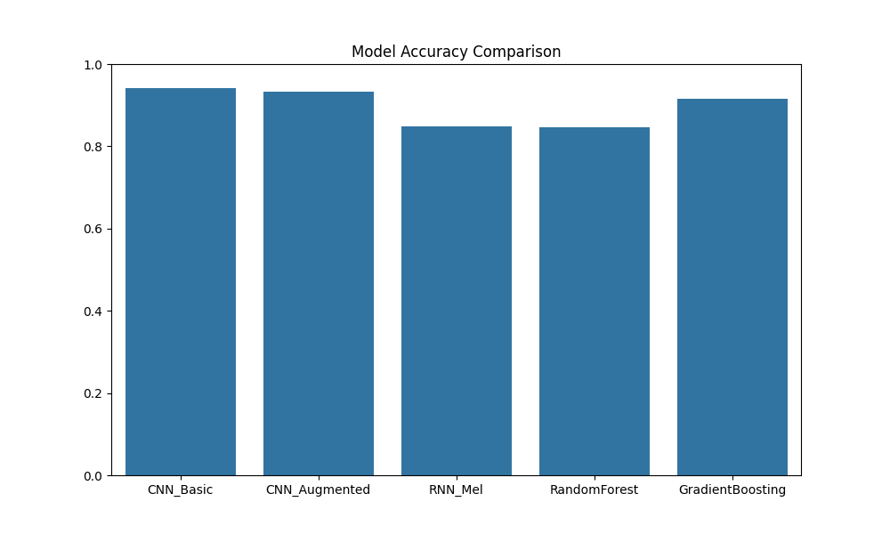
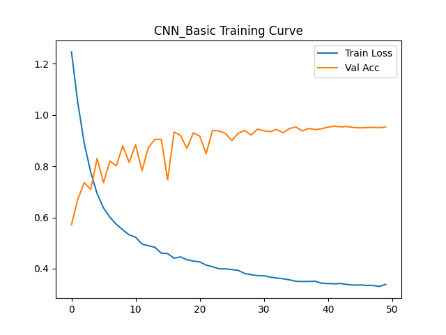
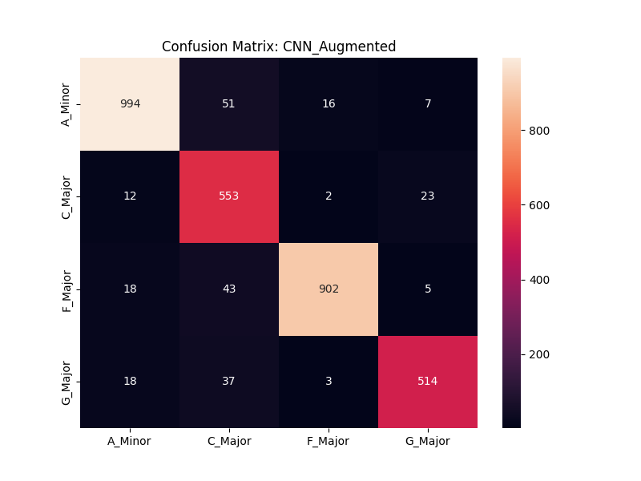
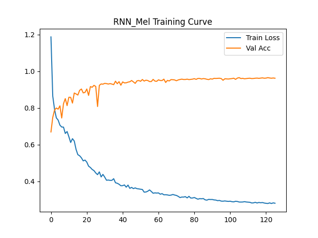
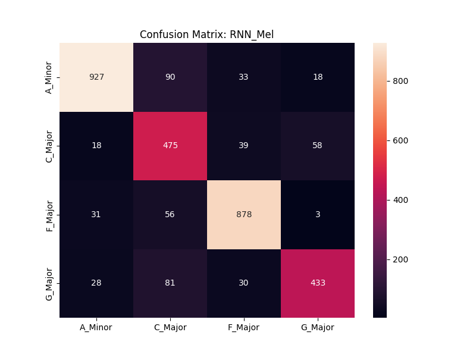

# KeyStone: Chord Classifier

## About
This project uses machine learning to classify musical chords. It trains models on **synthetic audio** (generated mathematically) and **real-world data** from YouTube. This allows the system to robustly identify chords (C Major, G Major, A Minor, F Major) across different instruments and recording conditions.

## Getting Started

### 1. Installation
Install the required dependencies:
```bash
pip install -r requirements.txt
```

### 2. Data Setup
Generate synthetic training data and (optionally) download real samples:
```bash
# Generate synthetic waveforms
python src/generator.py

# Download real examples from YouTube
python src/youtube_scraper.py --query "C Major Guitar Strum" --class_name "C_Major"
```

### 3. Training
Train the Deep Learning models (CNN, RNN):
```bash
python src/train.py
```
*Models are automatically saved to the `models/` directory.*

### 4. Run App
Launch the interactive web interface to test the models:

## Result Highlights
### Model Comparison


*We see that the RNN performed the best, but all deep learning models had high-performance, with their validation accuracy being greater than 94%.*

### Training Performance (CNN)
| Training Curve | Confusion Matrix |
|:---:|:---:|
|  |  |

### Training Performance (CNN with Augments)
| Training Curve | Confusion Matrix |
|:---:|:---:|
|  |  |

### Training Performance (RNN)
| Training Curve | Confusion Matrix |
|:---:|:---:|
|  |  |

*Results show that Deep Learning models (CNN & RNN) trained on synthetic data generalize well to real-world examples.*
